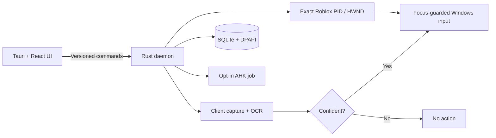

<div align="center">
  
</div>

<div align="center">
<h1>NectarPilot</h1>

[](https://github.com/Kerim-Sabic/roblox/actions/workflows/ci.yml)
[](LICENSE.md)


**A modern, safety-first Windows control center for Bee Swarm Simulator automation.**

[Architecture](docs/ARCHITECTURE.md) · [Parity matrix](docs/PARITY_MATRIX.md) · [Security](docs/SECURITY.md) · [Contributing](CONTRIBUTING.md)

</div>

> [!WARNING]
> **NectarPilot is pre-beta software.** The compatibility harness is load-validated, but full attended gameplay testing and the required 24-hour/72-hour soaks are not complete. Native routes remain blocked until detector calibration is reviewed. Do not treat this branch as a finished drop-in replacement for Natro Macro.

NectarPilot rebuilds the Natro Macro v1.1.2 experience around a Tauri 2 desktop, a React/TypeScript interface, and a Rust automation daemon. It operates through screen capture and guarded keyboard/mouse input only—there is no Roblox injection, process memory reading, client modification, or anti-cheat bypass.

## What works today

| Area                                                     | Current state                                                               |
| -------------------------------------------------------- | --------------------------------------------------------------------------- |
| Fluent Honey dashboard and compact monitor               | **Implemented**                                                             |
| `RobloxPlayerBeta.exe` PID/HWND discovery                | **Implemented** with manual and automatic refresh                           |
| Native PID/HWND input guard and emergency release        | **Implemented as tested primitives**; production native runs remain blocked |
| Client capture, multi-scale matching, temporal consensus | **Implemented**; live calibration is still in progress                      |
| English vocabulary-constrained Windows OCR               | **Implemented** with bounded preprocessing and fail-closed results          |
| Legacy asset inventory                                   | **103 assets**: 91 routes + 12 patterns                                     |
| Generated legacy compatibility harness                   | **390 variants load-validated** with the pinned AutoHotkey interpreter      |
| Native `.nectar.yaml` conversion                         | **In progress**; Stationary is schema-valid but not executable yet          |
| Quest knowledge                                          | **103 quest definitions** across Science, Black, Polar, Bucko, and Riley    |
| Captured gameplay fixtures and release soaks             | **Not complete**                                                            |

## Built for failure, not just the happy path

<table>
  <tr>
    <td width="33%" valign="top">
      <h3>🎯 Exact native targeting</h3>
      Native input primitives bind to one adopted Roblox PID and window and release on focus or ownership changes. Production native runs stay blocked until detector calibration is reviewed.
    </td>
    <td width="33%" valign="top">
      <h3>👁️ Evidence before action</h3>
      A detector must return a confident, temporally consistent result. <code>Unknown</code>, <code>Uncertain</code>, and <code>NotFound</code> can never become movement targets.
    </td>
    <td width="33%" valign="top">
      <h3>🛡️ Safe defaults</h3>
      Valuable-item budgets start at zero. Purchases, donations, trades, Discord control, remote input, and power actions require explicit permission.
    </td>
  </tr>
  <tr>
    <td width="33%" valign="top">
      <h3>🔒 Local secrets</h3>
      The daemon is the only state writer. SQLite updates are transactional and private-server/webhook secrets are protected with current-user Windows DPAPI.
    </td>
    <td width="33%" valign="top">
      <h3>🧩 Contained compatibility</h3>
      Legacy scripts require exact-digest trust, a verified interpreter, pinned support files, one foreground client, and a bounded Windows job object.
    </td>
    <td width="33%" valign="top">
      <h3>🧯 Bounded recovery</h3>
      Reconnects have attempt and time limits. Ambiguous state ends in <code>NeedsAttention</code>; weak OCR or inactive honey alone can never restart Roblox.
    </td>
  </tr>
</table>

## Architecture



The WebView has no direct shell, filesystem, process, or input access. The daemon owns configuration, scheduling, diagnostics, perception, and automation over a current-user-only named pipe. See the full [architecture and safety invariants](docs/ARCHITECTURE.md).

## Legacy parity without blind execution

The untouched Natro v1.1.2 import is preserved by the `natro-v1.1.2-import` tag. NectarPilot catalogs every built-in route and pattern, pins its digest, and reconstructs Natro's complete walk environment around each fragment.

```text
91 routes + 12 patterns = 103 catalogued assets
102 compatibility-bridge assets + 1 schema-valid native DSL preview
390 generated route/pattern/reset variants validated to load
```

Load validation does not claim live gameplay parity. The authoritative progress record is the [feature parity matrix](docs/PARITY_MATRIX.md), and the bridge's trust/containment model is documented in [legacy compatibility](docs/LEGACY_COMPATIBILITY.md).

## Perception and OCR

NectarPilot treats OCR as evidence, not truth. Small HUD and quest crops are enlarged within strict pixel budgets, evaluated through multiple contrast variants, constrained to known Bee Swarm vocabulary, and required to agree across recent frames. Ambiguous readings remain non-actionable and can retain a cropped local diagnostic for review.

Current quest catalogs cover:

- 31 Science Bear quests
- 18 Black Bear quests
- 20 Polar Bear quests
- 17 Bucko Bee quests
- 17 Riley Bee quests

Live accuracy is not published yet; it will be measured only against captured fixtures across supported sizes, DPI levels, overlays, day/night scenes, and disconnect states.

## Run the development build

NectarPilot does not have a public beta release yet. Development requires Windows 10/11 x64, Node.js 22, pnpm 10, Rust 1.96.0, WebView2, and the Microsoft C++ build tools used by Tauri.

```powershell
git clone https://github.com/Kerim-Sabic/roblox.git
cd roblox
corepack enable
pnpm install --frozen-lockfile
pnpm dev
```

In a source checkout, `START.bat` runs the same Tauri development application. The desktop creates a `Default (Safe)` profile with valuable-item budgets set to zero.

<details>
<summary><strong>Run the full verification suite</strong></summary>

```powershell
./scripts/verify-no-secrets.ps1
./scripts/verify-parity-fixtures.ps1
pnpm --filter @nectarpilot/desktop check
pnpm --filter @nectarpilot/desktop lint
pnpm --filter @nectarpilot/desktop test
cargo fmt --all -- --check
cargo clippy --workspace --all-targets -- -D warnings
cargo test --workspace
cargo run -p nectarpilot-legacy --bin validate_legacy_assets
```

</details>

## Road to beta

- [x] Rust/Tauri foundation, versioned IPC, profiles, migrations, and emergency stop
- [x] Read-only Roblox discovery, guarded input, client capture, and OCR foundation
- [x] Complete legacy route/pattern inventory and generated harness load validation
- [ ] Reviewed detector calibration and captured gameplay fixture suite
- [ ] Attended full-parity live test with all spending disabled
- [ ] Clean 24-hour beta soak
- [ ] Clean 72-hour stable soak and 50 forced recovery scenarios
- [ ] Public installer and signed updater release

Release gates are intentionally mechanical. Read [RELEASE.md](docs/RELEASE.md) and the [live-test protocol](docs/LIVE_TEST_PROTOCOL.md) before interpreting a green unit-test suite as gameplay readiness.

## Contributing

Useful contributions include sanitized detector fixtures, DPI/window-size regressions, route conversions, accessibility improvements, and reproducible failure reports. Please read [CONTRIBUTING.md](CONTRIBUTING.md) and [SECURITY.md](docs/SECURITY.md) before opening a pull request or sharing diagnostics.

If this direction is useful, star the repository and help test the safety boundaries—not just the successful paths.

## Account risk and non-affiliation

[Roblox states that cheating or exploiting violates its rules](https://en.help.roblox.com/hc/en-us/articles/203312450-Cheating-and-Exploiting) and may lead to account moderation or deletion. Users are responsible for checking current Roblox rules and the rules of the experience they automate. NectarPilot does not hide automation or bypass anti-cheat systems.

NectarPilot is an independent GPLv3 fork. It is not affiliated with or endorsed by Natro Team, Roblox Corporation, Onett, or the Bee Swarm Simulator developers.

## License and attribution

NectarPilot is licensed under the [GNU General Public License v3.0](LICENSE.md). It is based on Natro Macro, Copyright &copy; Natro Team and its contributors. Modifications are recorded in this repository's Git history, and bundled third-party components are listed in [THIRD_PARTY_NOTICES.md](THIRD_PARTY_NOTICES.md).
